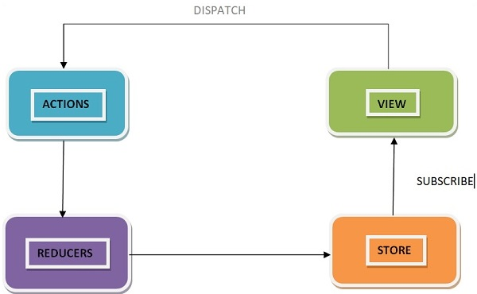
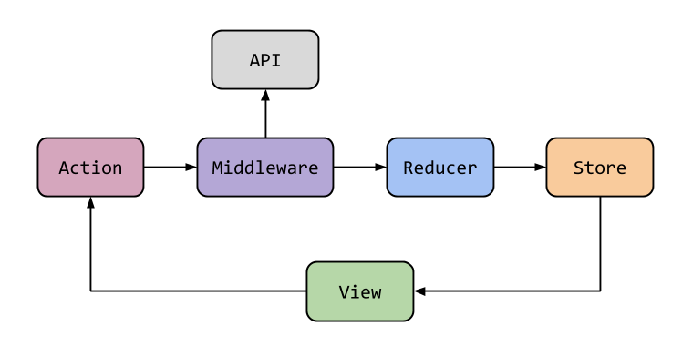

# Redux

### What is Redux ?

- Redux is a state management library that allows you to manage the state of your JavaScript applications more efficiently and predictably.

- Redux works similarly by keeping track of your application's state in a single place called the **"store."**

- Redux is a pattern and library for managing and updating application state, using events called **"actions"**

- Redux is not limited to React and you can use it with other frameworks or even vanilla JavaScript.

### Why Should I Use Redux ?

- Redux helps you manage "global" state - state that is needed across many parts of your application.

- **Centralized state management** :-

  - you can maintain the state of your entire application in a single store
  - making it easier to manage and access data across components.

- **Predictable state updates** :-

  - Redux has a clear flow of data, which means changes to the state can only happen when you create an action and send it through Redux.

- **Easier debugging** :-

  - With Redux DevTools, you have a clear record of all the changes to your application's state
  - This makes locating and fixing issues in your code easier, saving you time and effort in the debugging process.

- **Better performance** :-
  - By minimizing the number of state updates and reducing the need for prop drilling

### How Does Redux Work ?

- Redux enables you to maintain a single centralized store that manages the state of your entire application

- The key components that enable this centralized approach to state management are:

  - [Store](#store)
  - [Actions](#actions)
  - [Dispatch](#dispatch)
  - [Reducers](#reducers)

- #### Store

  - The Redux store is like a giant container that holds all the data for your application.

  - the store is the single source of truth for your application's state. This means that any component in your application can access it to retrieve and update data.

  ```js
  const redux = require("redux");
  const createStore = redux.createStore;

  const store = createStore(reducer);
  ```

- #### Actions

  - An action is an object that describes what changes need to be made to the state of your application

  - It sends data from your application to the Redux store and serves as the only way to update the store

  - An action must have a **"type"** property describing the action being performed

  - An action can have a **"payload"** property. The **"payload"** property represents the data that provides additional information about the action being performed

  ```js
  {
    type: 'ADD_TASK',
    payload: {
      id: 1,
      text: 'Buy groceries',
      completed: false
    }
  ```

- Note that to create actions, we use **action creators**

- **Action creators** :- are functions that create and return action objects.

  ```js
  function addTask(taskText) {
    return {
      type: "ADD_TASK",
      payload: {
        id: 1,
        text: taskText,
        completed: false,
      },
    };
  }
  ```

- #### Dispatch

  - **dispatch** is a function provided by the store that allows you to send an action to update the state of your application

  - When you call dispatch, the store runs an action through all of the available reducers

  ```js
  store.dispatch(addTask());
  store.dispatch(deleteTask());
  ```

- #### Reducers

  - A reducer is a function that takes in **the current state** of an application and an **action as arguments**, and returns **a new state** based on the action.

  ```js
  const initialState = {
    tasks: [],
  };

  const taskReducer = (state = initialState, action) => {
    switch (action.type) {
      case "ADD_TASK":
        return {
          ...state,
          tasks: [...state.tasks, action.payload],
        };

      case "DELETE_TASK":
        return {
          ...state,
          tasks: state.tasks.filter((task) => task.id !== action.payload),
        };
      default:
        return state;
    }
  };
  ```

  

### How to install Redux

- Redux requires a few dependencies for its operations, namely:

  - **Redux**: The core library enables the redux architecture.
  - **React Redux**: Simplifies connecting your React components to the Redux store.
  - **Redux Thunk**: Allows you to write asynchronous logic in your Redux actions.
  - **Redux DevTools Extension**: Connects your Redux application to Redux DevTools

    ```sh
      npm install redux
      npm install react-redux
      npm install redux-thunk
      npm install redux-devtools-extension
    ```

### What Is Redux Middleware ?

- Redux Middleware allows you to intercept every action sent to the reducer so you can make changes to the action or cancel the action.

- Middleware sits between the dispatch function and the reducers, and can intercept, modify, or even completely stop actions before they reach the reducers.

- Middleware helps you with logging, error reporting, making asynchronous requests, and a whole lot more.

### How to Create Middleware in React

- To create a middleware in Redux, you typically define a function that takes **store** as an argument and returns another function that takes **next** as an argument

- The **inner function** should return a function that takes **action** as an argument

```js
import { applyMiddleware } from "redux";

// we're creating a loggerMiddleware
const loggerMiddleware = (store) => (next) => (action) => {
  // your code
};

// Once the middleware function is created, we pass it to the applyMiddleware function
const middleware = applyMiddleware(loggerMiddleware);
// finally, we pass the middleware to the createStore
const store = createStore(reducer, middleware);
```

- What will happen If we don't call the next function inside the loggerMiddleware ?

  - the action will not be sent to the reducer so the store will not be updated

### How and When to use BindActionCreators

- that automatically binds action creators to a dispatch function.

- It returns an object that contains the same set of action creators, but with each action creator wrapped into a dispatch call.

```js
const redux = require("redux");
redux.bindActionCreators(actionCreators, dispatch);
```

- The **actionCreators argument** can be either a single action creator function or an object containing multiple action creator functions.

- The **dispatch argument** is the dispatch function provided by the Redux store.

### How to use combineReducers()

- provided by the Redux library that allows you to combine multiple reducers into a single reducer

- The combineReducers function takes an object as an argument, where each key-value pair represents a slice of the state

```js
  const redux = require('redux');

  const addTaskReducer = (state,action) {}
  const delTaskReducer = (state,action) {}

  const rootReducer = redux.combineReducers({addTask: addTaskReducer, delTask: delTaskReducer})
  const store = redux.createStore(rootReducer)
```

- that combineReducers does not modify the original reducers, it creates a new reducer function that calls the original reducers

### How to use Immer

- **Immer** is a library that simplifies the process of updating immutable state in Redux

- It allows you to write code that "mutates" state in a more natural way, without actually mutating the original state object.

- **Immer** provides a function called produce, which accepts two arguments: your original state, and a callback function

```sh
  npm install immer
```

```js
const produce = require("immer").produce;

const initialState = {
  name: "Anas",
  address: {
    street: "123 man St",
    city: "cairo",
    state: "AM",
  },
};
const STREET_UPDATED = "STREET_UPDATED";

const reducer = (state = initialState, action) => {
  switch (action.type) {
    case STREET_UPDATED:
      // return {
      //   ...state,
      //   address: {
      //     ...state.address,
      //     street: action.payload,
      //   },
      // };

      return produce(state, (draft) => {
        draft.address.street = action.payload;
      });

    default:
      return state;
  }
};
```

### How to use logger

- redux-logger is a middleware for Redux that logs all the actions and state changes that occur in your application

- It can be useful for debugging and understanding how your application is behaving over time.

```sh
npm install redux-logger
```

```js
const { createStore, applyMiddleware } = require("redux");
const logger = require("redux-logger");
import rootReducer from "./reducers";

const store = createStore(rootReducer, applyMiddleware(logger));
```

### How to use Redux-thunk

- By default actions in Redux are dispatched synchronously

- Redux Thunk is a middleware, meaning that it intercepts every action object before it reaches a reducer

- That function receives the store’s dispatch method, which is then used to dispatch regular synchronous actions inside the body of the function once the asynchronous operations have completed.



```sh
  npm install redux-thunk
```

```js
import { createStore, applyMiddleware } from "redux";
import thunk from "redux-thunk";
import rootReducer from "./reducers/index";

const store = createStore(rootReducer, applyMiddleware(thunk));
```

```js
const fetchUsers = () => {
  return function (dispatch) {
    dispatch(fetchUsersRequest());
    axios
      .get("https://jsonplaceholder.typicode.com/users")
      .then((response) => {
        const users = response.data.map((user) => user.id);
        dispatch(fetchUsersSuccess(users));
      })
      .catch((error) => {
        dispatch(fetchUsersFailure(error.message));
      });
  };
};
store.dispatch(fetchUsers());
```

## Redux Toolkit

```sh
  npm install @reduxjs/toolkit
```

### What is configureStore

- **configureStore** is a function provided by the @reduxjs/toolkit package that helps simplify the setup of a Redux store

- It provides a pre-configured Redux store that includes sensible defaults and middleware such as redux-thunk and redux-logger.

```js
import { configureStore } from "@reduxjs/toolkit";
import rootReducer from "./reducers";

const store = configureStore({
  reducer: {
    cake: cakeReducer,
  },
  devTools: process.env.NODE_ENV !== "production",
});
```

### What is createSlice

- **createSlice** is a function provided by the @reduxjs/toolkit package that helps simplify the creation of Redux slices

- **createSlice** generates a slice object that includes the reducer function, action creators, and action types for the slice.

- By using createSlice, you don't have to manually define action types and action creators for your slice

```js
import { createSlice } from "@reduxjs/toolkit";

const initialState = {
  numOfCake: 10,
};
const cakeSlice = createSlice({
  name: "cake",
  initialState,
  reducers: {
    ordered: (state) => {
      state.numOfCake--;
    },
    restocked: (state, action) => {
      state.numOfCake += action.payload;
    },
  },
});

module.exports = cakeSlice.reducer;
module.exports.cakeActions = cakeSlice.actions;
```

### What is getDefaultMiddleware

- A function provided by the @reduxjs/toolkit package that returns an array of middleware that are commonly used with Redux.

- By default, configureStore adds some middleware to the Redux store setup automatically.

- You can modify this array of middleware by adding or removing middleware as needed for your application

- _For example_, you might add **logger middleware** to log actions and state changes during development.

```js
const { configureStore } = require("@reduxjs/toolkit");
const reduxLogger = require("redux-logger");
const cakeReducer = require("../features/cake/cakeSlice");

const logger = reduxLogger.createLogger();

const store = configureStore({
  reducer: {
    cake: cakeReducer,
  },
  // Add logger middleware while keeping the default middleware.
  middleware: (getDefaultMiddleware) => getDefaultMiddleware().concat(logger),

  // Add logger middleware while removing the default middleware.
  middleware: [thunk, logger],
});
```

### What is extraReducers

- **extraReducers** is an optional configuration object that you can pass to createSlice function to handle additional actions that are not defined in the reducers object.

- **The extraReducers object** should be an object that maps action types to reducer functions.
- When an action is dispatched with a type that matches one of the keys in extraReducers, the corresponding reducer function will be called to update the state.

```js
const iceCreamSlice = createSlice({
  name: "iceCream",
  initialState,
  reducers: {
    ordered: (state) => {
      state.numOfIceCreams--;
    },
  },
  extraReducers: {
    ["cake/ordered"]: (state, action) => {
      state.numOfIceCreams--;
    },
    "some/other/action": (state, action) => {},
  },
});
```

- **The extraReducers function** can also be defined as an object where the keys are action types and the values are builder callback functions that return the builder object.

- **The builder object** can then be used to define how the state should be updated for the specific action type.

```js
const { cakeActions } = require("../cake/cakeSlice");

const iceCreamSlice = createSlice({
  name: "iceCream",
  initialState,
  reducers: {
    ordered: (state) => {
      state.numOfIceCreams--;
    },
    restocked: (state, action) => {
      state.numOfIceCreams += action.payload;
    },
  },
  extraReducers: (builder) => {
    builder.addCase(cakeActions.ordered, (state) => {
      state.numOfIceCreams--;
    });
    builder.addCase(cakeActions.restocked, (state) => {
      state.numOfIceCreams += 3;
    });
  },
});
```

### What is createAsyncThunk

- **createAsyncThunk** is a function that generates asynchronous action creators for handling API requests and responses.

**createAsyncThunk** takes two arguments:

- 1️⃣ A string that defines the name of **the action type prefix** for the asynchronous actions that createAsyncThunk will generate.

  - This prefix is used to create three action types: **pending, fulfilled,** and **rejected.**

- 2️⃣ A payload creator function that receives two arguments: a **payload** and a **thunkAPI object**

  - **The payload argument** is the data passed to the action creator when it is called

  - **The thunkAPI object** provides utility functions to work with thunks, like **dispatch** and **getState**.

```js
const fetchUsers = createAsyncThunk("user/fetchUsers", () => {
  return axios
    .get("https://jsonplaceholder.typicode.com/users")
    .then((response) => response.data.map((user) => user.id));
});

const userSlice = createSlice({
  name: "user",
  initialState,
  extraReducers: (builder) => {
    builder
      .addCase(fetchUsers.pending, (state) => {
        state.loading = true;
      })
      .addCase(fetchUsers.fulfilled, (state, action) => {
        state.loading = false;
        state.users = action.payload;
        state.error = "";
      })
      .addCase(fetchUsers.rejected, (state, action) => {
        state.loading = false;
        state.users = [];
        state.error = action.error.message;
      });
  },
});
```

## React-Redux

### What is Provider ?

- We use **Provider** in order to pass the store as an attribute

- Provider is a component that is used to provide the Redux store to all components in a React application.

- **The Provider component** is part of the **react-redux library**, which provides a set of bindings between **React** and **Redux**.

- Provider eases the pain of having to pass the store as props into each component

```js
import { Provider } from "react-redux";

ReactDOM.render(
  <Provider store={store}>
    <App />
  </Provider>,
  document.getElementById("root")
);
```

### What is mapStateToProps ?

- **mapStateToProps** is a function that is used to map the Redux store state to the props of a React component

- That is used in conjunction with **the connect function** provided by the react-redux library.

- The mapStateToProps function accepts **the current state** of the Redux store as an **argument**

```js
import { connect } from 'react-redux';

const mapStateToProps = (state) => {
  return {
    toDos: state.toDos,
    filter: state.filter,
  };
};

const TodoList = ({ toDos, filter }) => {
  // Render the list of toDos based on the current filter
  render() {
    return (
      <div className="App">
        <h3>toDos Count:</h3>
        <p>{toDos.length}</p>
      </div>
    );
  }
};

export default connect(mapStateToProps)(TodoList);
```

### What is mapDispatchToProps ?

- **mapDispatchToProps** is a function that is used to map Redux action creators to the props of a React component

- **mapDispatchToProps** function is used in conjunction with **the connect function** provided by the react-redux library.

```js
import { connect } from "react-redux";
import { addTodo, toggleTodo } from "../actions";

const mapDispatchToProps = (dispatch) => {
  return {
    onAddTodo: (text) => dispatch(addTodo(text)),
    onToggleTodo: (id) => dispatch(toggleTodo(id)),
  };
};

const TodoList = ({ toDos, onAddTodo, onToggleTodo }) => {
  // Render the list of toDos and a form to add new toDos
  return (
    <div>
      <ul>
        {toDos.map((todo) => (
          <li key={todo.id}>
            <input
              type="checkbox"
              checked={todo.completed}
              onChange={() => onToggleTodo(todo.id)}
            />
            {todo.text}
          </li>
        ))}
      </ul>
    </div>
  );
};
export default connect(null, mapDispatchToProps)(TodoList);
```
